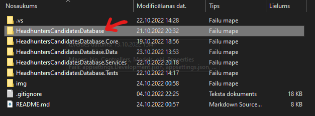
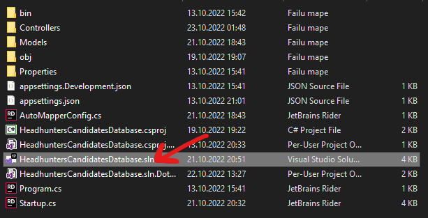
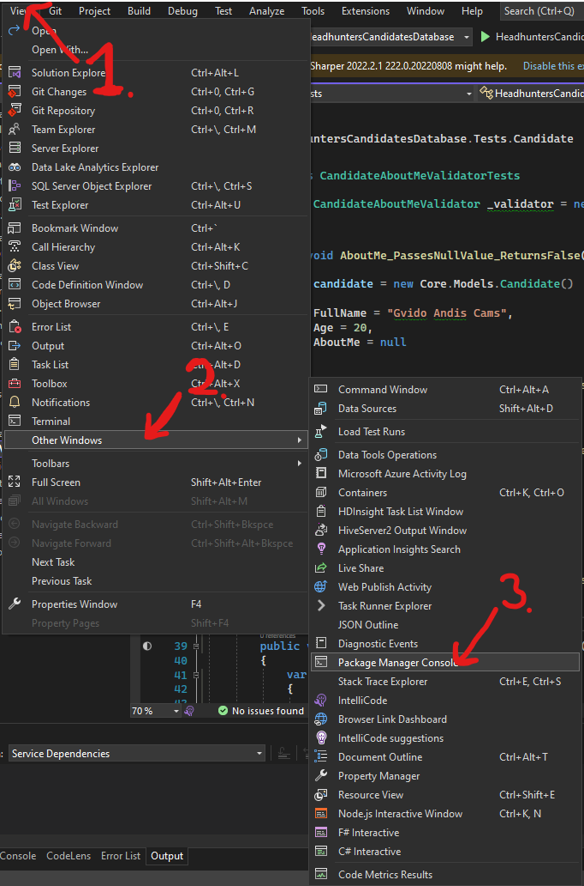
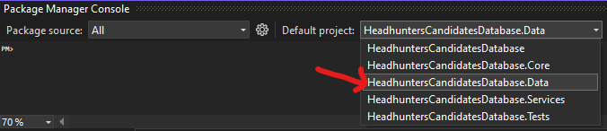

# Headhunters Candidates Database
# Description

This is a technical task for a company SIA "CatchSmart". Project contains an API with CRUD that consumes JSON requests and produces JSON responses with these objects:
* Candidates;
* Companies;
* Skills;
* Opened positions per positions;

Database has been created with Code First approach and validations have been unit tested.

# Install

* Fork this repository and clone it on your computer or download it as a .zip file and unarchive it;
* Open project in your file explorer and open HeadhuntersCandidatesDatabase and click on `HeadhuntersCandidatesDatabase.sln`




* In Visual Studio 2022 on the top left of the taskbar select View > Other Windows > Package Manager Console;



* Near the console area select default project as HeadhuntersCandidatesDatabase.Data;



* Inside console write `update-database`;
* Start the project without debugging;
* Done :)

# Usage 
 
 This API contains these endpoints: 

* ### Candidates:
    * Get a Candidate : `GET /api/candidate/{id}`

    |Parameter   |Type   |Rule   |
    |---|---|---|
    |`id`  |integer   |Required - Candidates id  |

    * Create a Candidate : `POST /api/candidate`
    
    ### JSON Request example

    
    ```c#
    {
      fullName: "string",
      age: integer,
      aboutMe: "string"
    }
    ```
    
    |Parameter   |Type   |Rule   |
    |---|---|---|
    |`fullName`  |string   |Required - Candidates Full Name  |
    |`age`   |integer   |Required - Candidates Age(can't be less than 1)  |
    |`aboutMe`   |string   |Required - Additional information about a candidate   |

    * Apply a Candidate to a Position : `POST /api/candidate/{id}/position/{positionId}`

    |Parameter   |Type   |Rule   |
    |---|---|---|
    |`id`  |integer   |Required - Candidates id  |
    |`postionId`   |integer   |Required - Postion id  |
    

    * Remove a Candidate from Position : `Delete /api/candidate/{id}/position/{PositionId}`

    |Parameter   |Type   |Rule   |
    |---|---|---|
    |`id`  |integer   |Required - Candidates id  |
    |`postionId`   |integer   |Required - Postion id  |
    
    * Add a Skill to a Candidate : `POST /api/candidate/{id}`

    ### JSON Request example

    ```c#
    {
      fullName: "string",
      age: integer,
      aboutMe: "string"
    }
    ```

    * Remove Skill from a Candidate : `Delete /api/candidate/{id/skill/{skillId}`

    |Parameter   |Type   |Rule   |
    |---|---|---|
    | `id` | integer | Required - Candidate id |
    | `skillId`  |integer   |Required - Skill id  |

    * Update a Candidate : `PATCH /api/candidate/{id}`

    ### JSON Request example

    ```c#
    {
      fullName: "string",
      age: integer,
      aboutMe: "string"
    }
    ```

    |Parameter   |Type   |Rule   |
    |---|---|---|
    | `id` | integer | Required - Candidate id |
    |`fullName`  |string   |Required - Candidates Full Name  |
    |`age`   |integer   |Required - Candidates Age(can't be less than 1)  |
    |`aboutMe`   |string   |Required - Additional information about a candidate   |

    * Delete a Candidate : `DELETE /api/candidate/{id}`

    |Parameter   |Type   |Rule   |
    |---|---|---|
    |`id`  |integer   |Required - Candidates id  |

* ### Companies:
    * Get a Company : `GET /api/company/{id}`

    |Parameter   |Type   |Rule   |
    |---|---|---|
    |`id`  |integer   |Required - Companies id  |

    * Create a Company : `POST /api/company`

    ### JSON Request example

    ```c#
    {
      companyName: "string",
      description: "string"
    }
    ```

    |Parameter   |Type   |Rule   |
    |---|---|---|
    | `companyName` | string | Required - Companies name |
    |`description`  |string   |Required - Company description  |

    * Add a Position for a Company : `POST /api/company/{id}/position`

    ### JSON Request example

    ```c#
    {
      title: "string",
      openedPositons: integer
    }
    ```

    |Parameter   |Type   |Rule   |
    |---|---|---|
    | `title` | string | Required - Postion title |
    |`openedPositions`  |integer   |Required - Opened positions for this position (can't be less than 1)  |

    * Update a Company : `PATCH /api/company/{id}`

    ### JSON Request example

    ```c#
    {
      companyName: "string",
      description: "string"
    }
    ```

    |Parameter   |Type   |Rule   |
    |---|---|---|
    | `id` | integer | Required - Company id |
    | `companyName` | string | Required - Company name |
    |`description`  | string   |Required - Company description  |

    * Delete a Company : `DELETE /api/company/{id}`

    |Parameter   |Type   |Rule   |
    |---|---|---|
    | `id` | integer | Required - Company id |

* ### Positions:
    * Get a Position : `GET /api/position/{id}`

    |Parameter   |Type   |Rule   |
    |---|---|---|
    | `id` | integer | Required - Position id |

    * Add a Skill to a Position : `POST /api/position/{id}/skill`

    ### JSON Request example

    ```c#
    {
      name: "string",
    }
    ```

    |Parameter   |Type   |Rule   |
    |---|---|---|
    | `id` | integer | Required - Position id |
    | `name` | string | Required - Skill name |

    * Remove a Skill from a Position : `DELETE /api/position/{id}/skill/{skillId}`

    |Parameter   |Type   |Rule   |
    |---|---|---|
    | `id` | integer | Required - Position id |
    | `skillId` | integer | Required - Skill id |

    * Update a Position : `PATCH /api/position/{id}`

    ### JSON Request example

    ```c#
    {
      title: "string",
      openedPositons: integer
    }
    ```

    |Parameter   |Type   |Rule   |
    |---|---|---|
    | `id` | integer | Required - Position id |
    | `title` | integer | Required - Position title |
    | `openedPositions` | integer | Required - Opened positions for this position(can't be less than 1) |

    * Delete a Position : `DELETE /api/position/{id}`

    |Parameter   |Type   |Rule   |
    |---|---|---|
    | `id` | integer | Required - Position id |

* ### Skills:
    * Get a Skill : `GET /api/skill/{id}`

    |Parameter   |Type   |Rule   |
    |---|---|---|
    | `id` | integer | Required - Skill id |

    * Add a Skill : `POST /api/skill`

    ### JSON Request example

    ```c#
    {
      name: "string"
    }
    ```

    |Parameter   |Type   |Rule   |
    |---|---|---|
    | `name` | string | Required - Skill name |

    * Update a Skill : `PATCH /api/skill/{id}`

    ### JSON Request example

    ```c#
    {
      name: "string"
    }
    ```

    |Parameter   |Type   |Rule   |
    |---|---|---|
    | `id` | integer | Required - Skill id |
    | `name` | string | Required - Skill name |

    * Delete a Skill : `DELETE /api/skill/{id}`

    |Parameter   |Type   |Rule   |
    |---|---|---|
    | `id` | integer | Required - Skill id |
    
# Technologies Used

* ASP.NET Core Web API;
* Entity Framework (core, sqlite, tools, design);
* xUnit (FluentAssert).

# Further Updates

If I had more time for this project, I would:
* Add an endpoint for position API that could return applied candidates sorted by skills that matches the position skills;
* Add an endpoint for position API that could return all candidates sorted by skills that matches the positions skills and if they have applied for this position;
* Add an endpoint for candidate API that could return companies sorted by skills that mathes the candidates skills.